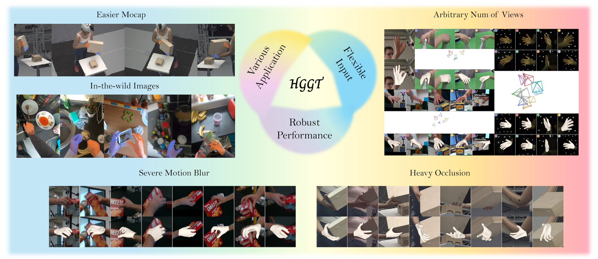

<h1 align="center">HGGT: Robust and Flexible 3D Hand Mesh Reconstruction from Uncalibrated Images</h1>

<p align="center">
  <a href="https://lym29.github.io/">Yumeng Liu</a><sup>1</sup>,
  <a href="https://www.xxlong.site/">Xiao-Xiao Long</a><sup>2</sup>,
  <a href="https://people.mpi-inf.mpg.de/~mhaberma/">Marc Habermann</a><sup>3</sup>,
  <a href="https://github.com/TheVaticanCameos">Xuanze Yang</a><sup>1</sup>,
  <a href="https://clinplayer.github.io/">Cheng Lin</a><sup>4</sup>,
  <a href="https://liuyuan-pal.github.io/">Yuan Liu</a><sup>5</sup>,
  <a href="https://yuexinma.me/">Yuexin Ma</a><sup>6</sup>,
  <a href="https://engineering.tamu.edu/cse/profiles/Wang-Wenping.html">Wenping Wang</a><sup>7*</sup>,
  <a href="http://staff.ustc.edu.cn/~lgliu/">Ligang Liu</a><sup>1*</sup>
</p>

<p align="center">
  <sup>1</sup>USTC &nbsp;
  <sup>2</sup>Nanjing University &nbsp;
  <sup>3</sup>MPI-INF &nbsp;
  <sup>4</sup>MUST Macau &nbsp;
  <sup>5</sup>HKUST &nbsp;
  <sup>6</sup>ShanghaiTech &nbsp;
  <sup>7</sup>Texas A&amp;M University
  <br>
  <sup>*</sup>Corresponding authors
</p>

<p align="center">
  <a href="https://arxiv.org/abs/2603.23997">
    
  </a>
  &nbsp;
  <a href="https://lym29.github.io/HGGT/">
    
  </a>
  &nbsp;
  <a href="https://huggingface.co/datasets/catmint123/HGGT-synthetic-data">
    
  </a>
  &nbsp;
  <a href="https://github.com/lym29/HGGT">
    
  </a>
</p>

---

<p align="center">
  
</p>

<p align="center">
  We introduce <b>H</b>and <b>G</b>eometry <b>G</b>rounding <b>T</b>ransformer (<b>HGGT</b>), a scalable and generalized solution for 3D hand mesh recovery. Our method unifies diverse data sources to achieve robust performance across varying camera viewpoints and environments.
</p>

---

## TL;DR

We present the **first feed-forward framework** that jointly estimates 3D hand meshes and camera poses from **uncalibrated** multi-view images.

## TODO

- [ ] Release synthetic dataset on Hugging Face
- [ ] Release dataset generation pipeline code
- [ ] Release pretrained model checkpoints
- [ ] Release model inference code
- [ ] Release demo scripts

---

## Dataset

### Download

Our synthetic dataset is available on Hugging Face:

<a href="https://huggingface.co/datasets/catmint123/HGGT-synthetic-data">
  
</a>

```bash
# Download via huggingface_hub
python -c "
from huggingface_hub import snapshot_download
snapshot_download(
    repo_id='catmint123/HGGT-synthetic-data',
    repo_type='dataset',
    local_dir='data/hggt_synthetic',
)
"
```

After downloading, extract the tar shards:

```bash
cd data/hggt_synthetic/small
for f in *.tar; do tar -xf "$f"; done
```

Please refer to the [dataset page](https://huggingface.co/datasets/catmint123/HGGT-synthetic-data) for details on the dataset structure.

---

## Citation

If you find our work useful in your research, please cite:

```bibtex
@article{liu2026hggt,
  title={HGGT: Robust and Flexible 3D Hand Mesh Reconstruction from Uncalibrated Images},
  author={Liu, Yumeng and Long, Xiao-Xiao and Habermann, Marc and Yang, Xuanze and Lin, Cheng and Liu, Yuan and Ma, Yuexin and Wang, Wenping and Liu, Ligang},
  journal={arXiv preprint arXiv:2603.23997},
  year={2026}
}
```
---

## License

This project is licensed under the [Apache License 2.0](LICENSE).


